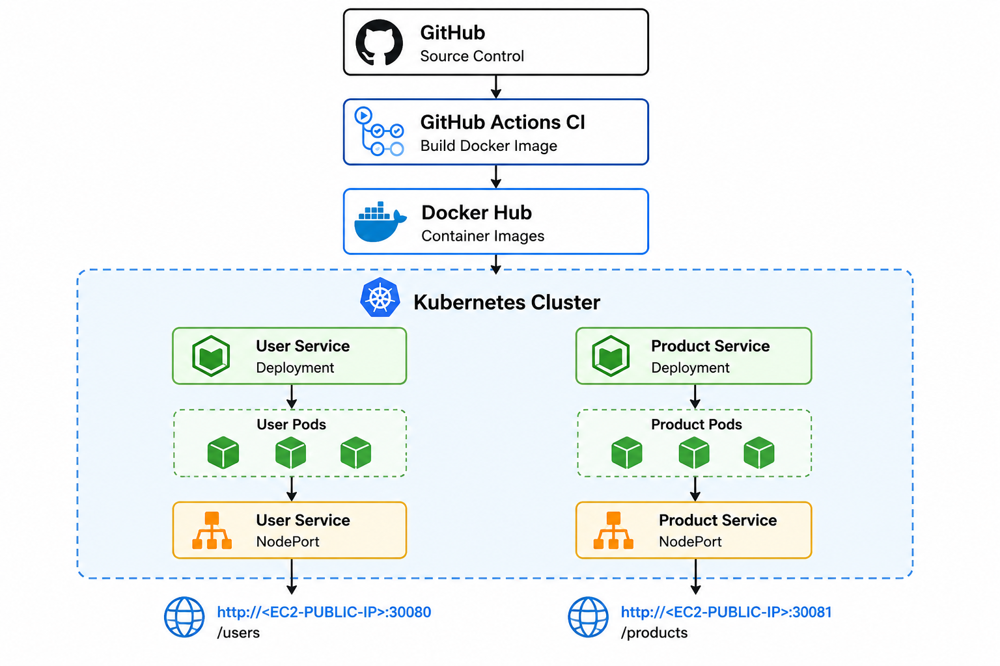
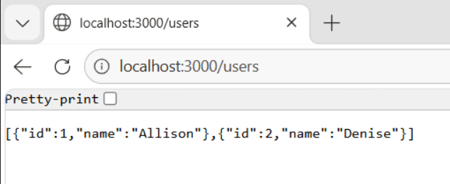
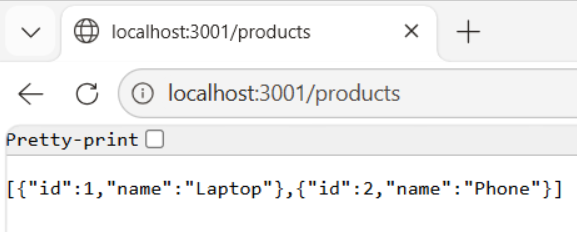
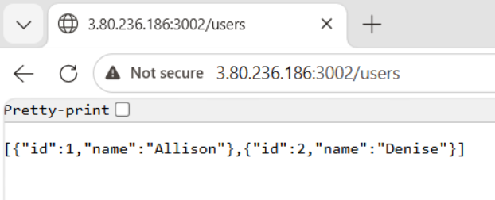
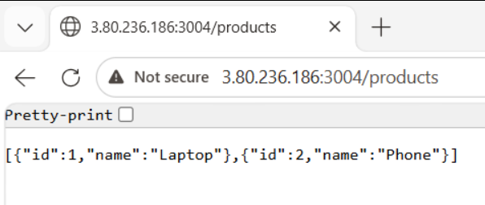
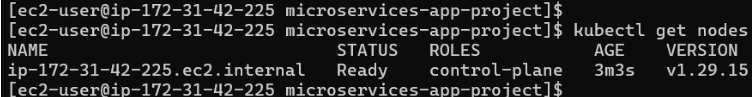
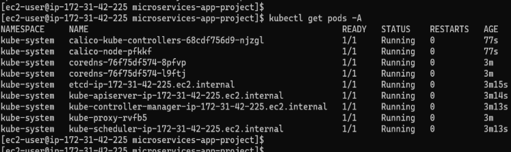
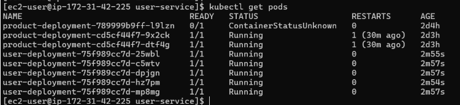

# Microservices Application Deployment on Kubernetes

A beginner-friendly end-to-end DevOps project demonstrating how to build, containerize, and deploy microservices using Docker and Kubernetes on AWS EC2.

This project was built as part of my DevOps learning journey to understand real-world application deployment workflows.

---

# Project Overview

This project contains two independent microservices:

- **User Service**
- **Product Service**

Both services are:
- Built using Node.js and Express
- Containerized with Docker
- Deployed on Kubernetes
- Exposed externally using Kubernetes Services
- Managed using Deployments
- Integrated with CI/CD using GitHub Actions

---

# Architecture



---

# Tech Stack

## Cloud
- AWS EC2 (Amazon Linux)

## Backend
- Node.js
- Express.js

## Containerization
- Docker

## Orchestration
- Kubernetes
- kubeadm
- kubectl
- containerd

## CI/CD
- GitHub Actions

## Container Registry
- Docker Hub

---

#  Project Structure

```text
microservices-project/
│
├── user-service/
│   ├── Dockerfile
│   ├── package.json
│   └── index.js
│
├── product-service/
│   ├── Dockerfile
│   ├── package.json
│   └── index.js
│
├── k8s/
│   ├── user-deployment.yaml
│   ├── user-service.yaml
│   ├── product-deployment.yaml
│   └── product-service.yaml
│
└── .github/
    └── workflows/
        └── docker-build.yml
```

# Application Endpoints

## User Service

```
http://localhost:3000/users
```

### Sample Response



## Product Service

```
http://localhost:3001/products
```

### Sample Response




# Docker Workflow

## Build Docker Images

```
docker build -t user-service .
docker build -t product-service .
```

## Run Containers

```
docker run -d -p 3000:3000 user-service
docker run -d -p 3001:3001 product-service
```
### Sample Response







---

# Kubernetes Deployment

## Apply Deployments

```
kubectl apply -f user-deployment.yaml
kubectl apply -f product-deployment.yaml
```

### Sample Response



## Apply Services

```
kubectl apply -f user-service.yaml
kubectl apply -f product-service.yaml
```

### Sample Response





# Scaling Example

Scale User Service to 5 replicas:

```
kubectl scale deployment user-deployment --replicas=5
```

# Rolling Update Example

Update deployment image:

```
kubectl edit deployment user-deployment
```

Kubernetes automatically performs:
- Gradual pod replacement
- Zero downtime deployment

---

# Self-Healing Demonstration

Delete a pod manually:

```
kubectl delete pod <pod-name>
```

Kubernetes automatically recreates the pod.

---

# Key Kubernetes Concepts Learned

| Concept | Description |
|---|---|
| Pod | Smallest deployable unit |
| Deployment | Manages pods and replicas |
| Service | Exposes applications |
| NodePort | External access method |
| ReplicaSet | Maintains desired pod count |
| Rolling Update | Zero downtime deployment |
| Self-Healing | Automatic pod recovery |

---

# Learning Outcomes

Through this project, I learned:

- Docker containerization
- Kubernetes fundamentals
- Kubernetes deployments and services
- Scaling and rolling updates
- CI/CD automation
- AWS EC2 infrastructure setup
- Docker Hub image management
- Real-world DevOps workflows

---

# Future Improvements

Planned enhancements:

- Kubernetes Namespaces
- ConfigMaps and Secrets
- Ingress Controller
- Helm Charts
- Monitoring with Prometheus & Grafana
- ArgoCD GitOps
- Terraform Infrastructure as Code
- HTTPS with TLS
- Multi-node Kubernetes Cluster

---

# Author

Built by me as part of my DevOps and Kubernetes learning journey.

---
